# katalon-Gen4-qengineer-automation

# User Guide

# Introduction

This repository contains all automated tests for Katalon Studio Enterprise product and owned by Quality Engineering team

- Automation Tool: Katalon Studio (Platform Edition or Enterprise)
- Language: Groovy, Java
- Design Pattern: Fluent Page Object Model

# **Prerequisites**

- Windows Application Driver.
- Java 8+ installed already.
- Katalon Studio (KS) latest version.  

# **High-Level Design**

# **Usage**
- Open Profile -> default and change these below global variables:

----G_KatalonPath 		: The full path to AUT, in our case, it is KS.
----G_SampleAPIProj 	: The full path to Sample API Project, it is under Data File folder of this project
----G_SampleWebProject	: The full path to Sample Web Project, it is under Data File folder of this project

## **UI Automation - Framework Structure**
	Project
	|_______Profiles
	|		|____default.glb
	|
	|_______Test Cases
	|		|____ACT- QE-251 - Online Activation by Email
	|		|____KEY-002 Create New Keyword
	|
	|_______Object Repository
	|		|____Activation
	|			 |____txtPassword
	|		|____Common
	|		|	 |____btnByName
	|		|	 |____txtByName
	|		|	 |____txtByClass
	|		|	 |____txtByWindow
	|		|____Dialog
	|		|____Katalon
	|		|____MenuBar
	|			 |____mnuItems
	|			 |____mnuLevel1
	|			 |____mnuLevel2
	|			 |____mnuLevel3
	|		
	|_______Test Suites
	|
	|_______Data Files
	|		|____SampleProject
	|			 |____SampleAPIProj
	|			 |____SampleWebProject
	|
	|_______Checkpoints
	|
	|_______Keywords
	|		|____katalon.fw.lib
	|		|	 |____BaseElement.groovy
	|		|	 |____BasePage.groovy
	|		|	 |____BaseElement.groovy
	|		|____katalon.fw.util
	|		|	 |____App.groovy
	|		|	 |____Helper.groovy
	|		|____katalon.fw.studio
	|			 |____KSKeyword.groovy
	|			 |____Project.groovy
	|			 |____TestCase.groovy
	|			 |____TestSuite.groovy
	|
	|_______Test Listeners
	|		|____KataDeskListener
	|
	|_______Reports
	|
	|_______Include
	|
	|_______Images
	|
	|_______Plugins
	|
	|_______build.gradle
	|
	|_______console.properties
	|
	|_______README.md

### <ins> **Profile** </ins>
**Objectives**: Consists of test environment configuration/ global variables for running tests
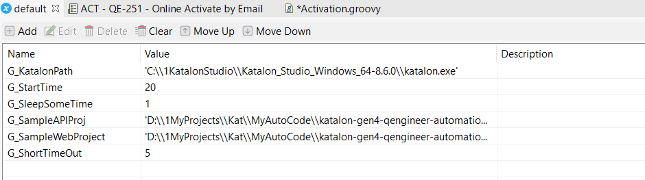

### <ins> **Keyword** </ins>
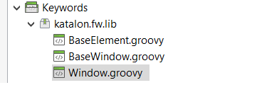
- `katalon.fw.*`: ***Using the keywords for building core framework function***
  - `BaseElement.groovy`: Define wrap-up methods of findTestObject from Object Repository to locate element on Window Object Classes (eg. class, id, link, name, ...)
    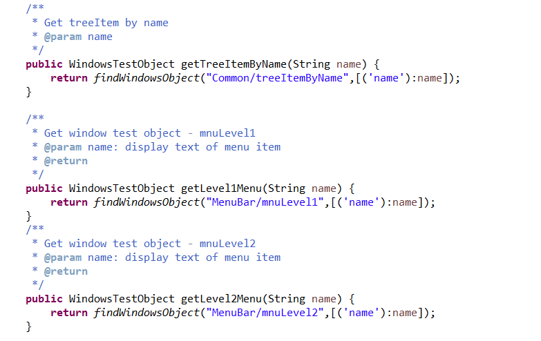
  #####
  - `Window.groovy`: Generate Window Object Classes leverage singleton design pattern in 2 forms (Lazy - *creation of instance at load time* & Early Instantiation - *creation of instance when required*) to help to save memory because object is not created at each request
    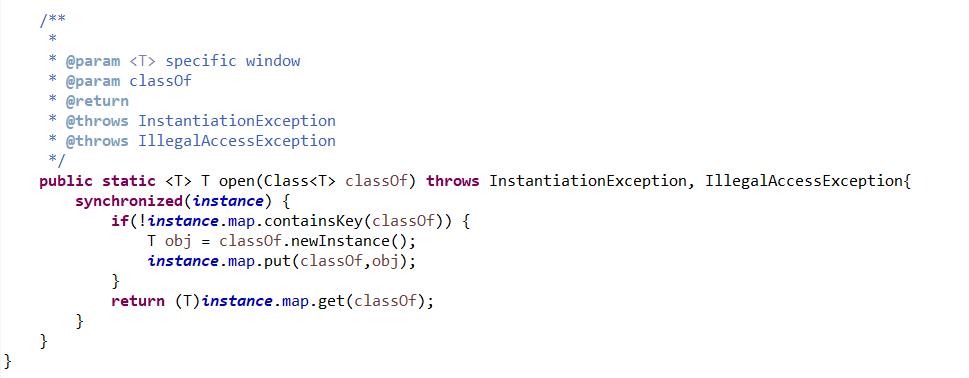
  #####
  - `BaseWindow.groovy`: Parent window for other window objects classes, contains common functions such as open a menu item, click on button, ...
    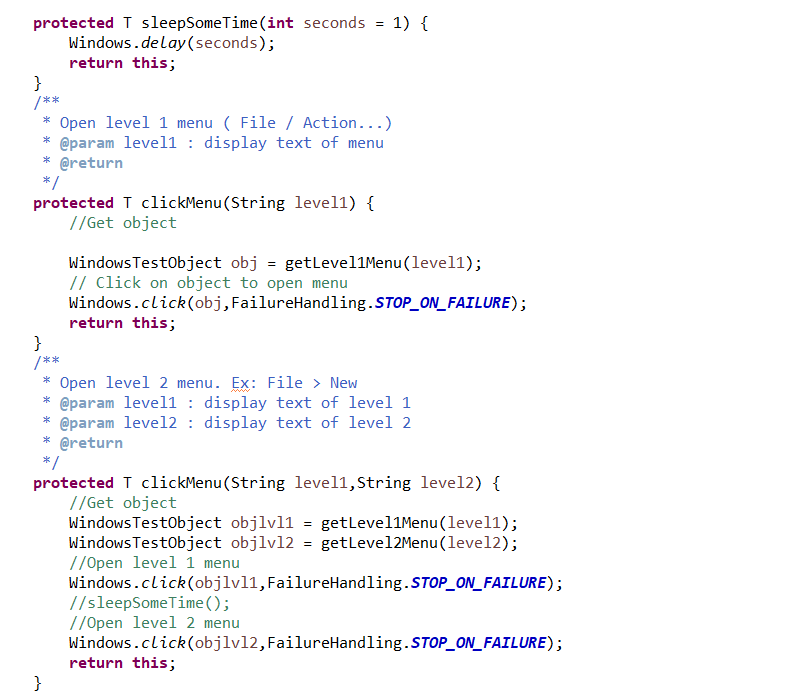
  #####
- `katalon.studio.groovy`: ***Implement the Page Object Model (POM Pattern) to make the Window Test Objects (UI Objects) attached to their pages (Page Objects) to do the Windows actions such as clicking a button or filling in a textbox***
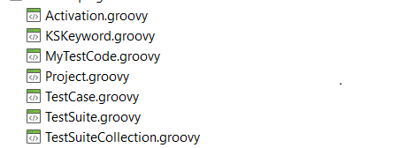
  - Those are organized based on the feature site maps and each class will be inherited from `BaseWindow` class
  - Must not contain utility functions, it should be implement as window element-action-based design
  

### <ins> **Object Repository** </ins>

- **Objective**: To avoid test object duplication during development time and help to reduce performance issue, as well as simply the way to define test objects
- **Recommendation**: The Scripter should try to use dynamic element to avoid creating too many test objects.
- **Usages**:  
  * btn: To locate Button element, only need input label of button which want to locate to
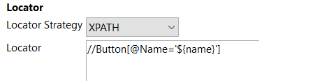
  * class: To locate element by class attribute, only need input class name of element which want to locate to
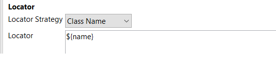
  * window name: To locate element by window name, only need input window name attribute and label of element in which window want to locate to                                                                            
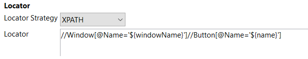                                       

### <ins> **Test Cases** </ins>
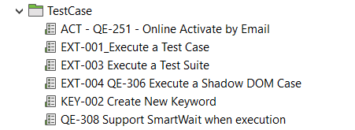
- Test scripts are organized based on the site maps. For examples, test cases for Execution feature should be stored under Execution folder.
- **Usages**: 
  - Required follow naming convention as [automation practices](https://katalon.atlassian.net/wiki/spaces/ENG/pages/2354249760/WIP+Automation+Practices)
  - Test case design follow Fluent Page Object Model
  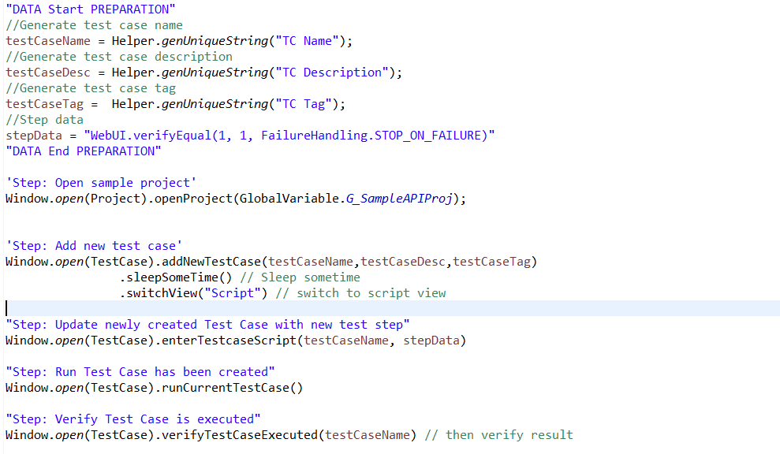

### <ins> **Test Data | Data Files** </ins>
- **Objectives**: Contains all of data-driven test for automated tests, leveraging excel file to store data, and organized follow site map of AUT
- **Usages**:
  - We have to some pre-define project type like Web Project or API project. These sample projects must have some test cases that will be run to verify some features of KS.
  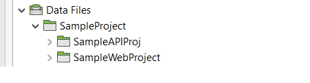

### <ins> **Test Listener** </ins>
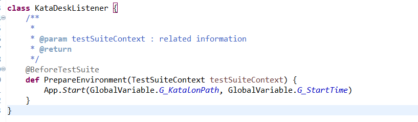
- Handle test hook actions(@BeforeTestCase, @AfterTestCase, @BeforeTestSuite, @AfterTestSuite...). In our case we use this function to start Application Under Test (when run Test Suite)
### <ins> **Test Suites: TBD** </ins>

# Report: *(TBD)*
# Reference Sources
- [Automation practices](https://katalon.atlassian.net/wiki/spaces/ENG/pages/2354249760/WIP+Automation+Practices)

